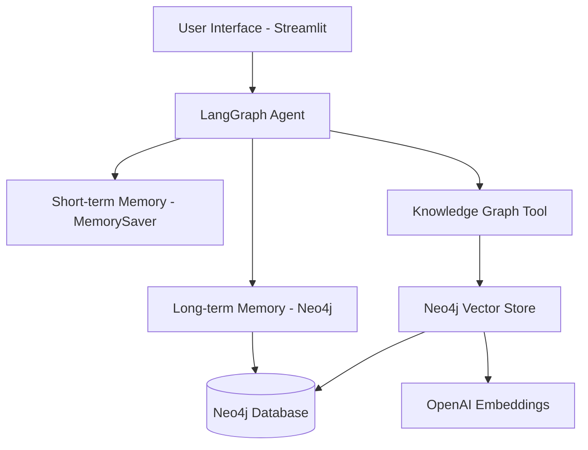

# Napoleon History Chatbot 🤖👑

A sophisticated AI chatbot specialized in Napoleon Bonaparte history, featuring dual memory systems and intelligent tool usage. The agent autonomously decides when to query the knowledge graph database based on user questions.

## Features

- **Dual Memory System**: Short-term (conversation context) + Long-term (persistent user memories)
- **Intelligent Tool Usage**: AI agent decides autonomously whether to query the knowledge database
- **RAG Integration**: Retrieval-Augmented Generation with Napoleon historical documents
- **Multi-User Support**: Separate memory storage for different users
- **Thread-Based Conversations**: Multiple conversation threads per user
- **Vector Search**: Semantic search through historical Napoleon documents using OpenAI embeddings

## Architecture



## 📁 Project Structure

```
napoleon-chatbot/
├── app.py                          # Main Streamlit application
├── functions/
│   ├── main.py                     # Agent configuration
│   ├── config.py                   # Database and LLM setup
│   ├── prompts.py                  # System prompts
│   └── Memory/
│       ├── memory.py               # Memory management functions
│       └── db.py                   # Neo4j memory store implementation
├── requirements.txt                # Python dependencies
├── .env                           # Environment variables (create this)
└── README.md                      # This file
```

### Example Interactions

**General Knowledge (No Tool Usage):**
```
User: "Hello, how are you?"
Bot: "Hello! I'm doing well. I'm here to help you learn about Napoleon Bonaparte..."
```

**Historical Query (Tool Usage):**
```
User: "Tell me about the Battle of Waterloo"
Bot: *[Internally decides to use knowledge graph tool]*
Bot: "The Battle of Waterloo took place on June 18, 1815..."
```

### Memory Features

**Short-term**: Remembers the current conversation context
- "You mentioned earlier about Waterloo..."

**Long-term**: Remembers across different sessions
- "I recall from our previous conversations that you're interested in military tactics..."

## Customization Options

### Change User Identity
```python
# In functions/Memory/memory.py
user_id = "historian-john"  # Your custom user ID
default_app_ctx = "napoleon-research"  # Default thread context
```

### Modify Memory Retrieval
```python
# In functions/Memory/memory.py
def load_and_save_long_term(state: dict) -> list:
    # Change limit to retrieve more/fewer memories
    records = long_term_memory_store.search_memory(namespace, limit=10)  # Default: 5
```

## Advanced Features

### Multiple Conversation Threads
Each user can maintain multiple conversation contexts:
```python
thread_ids = [
    "battles-discussion",
    "personal-life-questions", 
    "political-strategy",
    "exile-period"
]
```

### Custom Knowledge Integration
Add your own Napoleon documents to the vector store:
```python
# Your custom document ingestion code
vector_store.add_documents([
    Document(page_content="Your Napoleon content here...")
])
```

## Acknowledgments

- Built with LangGraph and LangChain frameworks
- Powered by OpenAI's language models and embeddings
- Neo4j for robust graph database capabilities
- Streamlit for the intuitive user interface

---

**Happy chatting with Napoleon! 👑⚔️**
